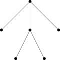

# LuaMetaPost

LuaMetaPost is a lua library which helps to generates MetaPost (.mp) files.

LaTeXer usually adopt MetaPost to draw figures.
But for diagrams, e.g., trees, MetaPost is a bit low-level.
Users must carefully arrange coordinates of nodes and calculate intersections of links and nodes.

LuaMetaPost fills the gap.
It provides useful shapes (circle, rectangle, bullet, text) and layout algorithms (matrix and tree).
So users can focus on high-level structures.

Here is an example of tree.
```lua
local luamp = require 'luamp'
local table = require 'table'

local tree = luamp.layouts.tree(
    luamp.origin, 2, 2,
    {luamp.bullet,
     {luamp.bullet},
     {luamp.bullet,
      {luamp.bullet},
      {luamp.bullet}},
     {luamp.bullet}})

local lines = {}
local function calcLines(tree)
    assert(#tree > 0, tostring(#tree))
    local rt = tree[1]
    for i = 2, #tree do
        table.insert(lines, luamp.line(rt, tree[i][1]))
        calcLines(tree[i])
    end
end
calcLines(tree.shapes)

print(luamp.figure(tree, table.unpack(lines)))
```
When this program is executed, it will show following metapost codes on stdout.
```metapost
beginfig(0);
fill fullcircle scaled 0.20cm shifted (0.00cm,2.00cm);
fill fullcircle scaled 0.20cm shifted (-2.00cm,0.00cm);
fill fullcircle scaled 0.20cm shifted (0.00cm,0.00cm);
fill fullcircle scaled 0.20cm shifted (-1.00cm,-2.00cm);
fill fullcircle scaled 0.20cm shifted (1.00cm,-2.00cm);
fill fullcircle scaled 0.20cm shifted (2.00cm,0.00cm);
draw (-0.08cm,1.92cm)--(-1.92cm,0.08cm);
draw (0.00cm,1.89cm)--(0.00cm,0.11cm);
draw (-0.05cm,-0.10cm)--(-0.95cm,-1.90cm);
draw (0.05cm,-0.10cm)--(0.95cm,-1.90cm);
draw (0.08cm,1.92cm)--(1.92cm,0.08cm);
endfig;
end
```
which looks like


## General APIs

### figure(...)

```figure``` accepts zero or more shapes or layouts, ```draw```s them, and wraps the result by ```beginfig(0);``` and ```endfig;end```.

### draw(shape)

```draw``` accepts one shape or layout, and generates its MetaPost instructions.

For example, 
```lua
luamp.draw(luamp.circle(luamp.origin, 1))
```
will return the following string
```
draw fullcircle scaled 2.00cm shifted (0.00cm,0.00cm);
```

### point(x, y)

Returns a point on (x,y).

### origin

```origin``` is the point whose x and y are both 0.

### center(shape)

```shape``` returns the center of a shape.

### vertices(shape)

```vertices``` returns a list of points of corners, if the shape has corners, such as lines, arrows and rectangles.

## Shapes

### circle(center, radius, opts)

```opts``` is optional. See colors and line styles for details.

For example, 
```lua
luamp.draw(luamp.circle(luamp.origin, 1))
```
will return the following string
```
draw fullcircle scaled 2.00cm shifted (0.00cm,0.00cm);
```
### text(center, direction, text, opts)

Shows some text.

```direction``` can be ```directions.center```, ```directions.left```, ```directions.right```, ```directions.top```, ```directions.bottom```, ```directions.top_right```, ```directions.top_left```, ```directions.bottom_left```, ```directions.bottom_right```.

```opts``` is optional. See colors and line styles for details.

For example, 
```lua
luamp.draw(luamp.text(luamp.origin, luamp.directions.center, '$\\Sigma$'))
```
will return the following string
```
label(btex $\Sigma$ etex, (0.00cm,0.00cm));
```

### line(from, to, opts)
### arrow(from, to, opts)
### dblarrow(from, to, opts)

All of these three APIs draw a line from the point ```from``` to the point ```to```, with no arrow, single arrow or double arrow respectively.

```opts``` is optional. See colors and line styles for details.

For example, 
```lua
luamp.draw(luamp.arrow(luamp.origin, luamp.point(1, 0)))
```
will return the following string
```
drawarrow (0.00cm,0.00cm)--(1.00cm,0.00cm);
```

### polyline(shapes, opts)
### polyarrow(shapes, opts)
### polydblarrow(shapes, opts)

All of these three APIs draw a polyline across center of ```shapes```, one by one, with no arrow, single arrow or double arrow respectively.

```opts``` is optional. See colors and line styles for details.

For example, 
```lua
luamp.draw(luamp.polyarrow({luamp.origin, luamp.point(1, 0), luamp.point(1, 1)}))
```
will return the following string
```
draw (0.00cm,0.00cm)--(1.00cm,0.00cm);
drawarrow (1.00cm,0.00cm)--(1.00cm,1.00cm);
```

### rectangle(center, length, height, opts)

Draws a rectangle.

```opts``` is optional. See colors and line styles for details.

For example, 
```lua
luamp.draw(luamp.rectangle(luamp.origin, 2, 1))
```
will return the following string
```
draw (-1.00cm,0.50cm)--(1.00cm,0.50cm)--(1.00cm,-0.50cm)--(-1.00cm,-0.50cm)--cycle;
```

### bullet(center, opts)

Draws a bullet.

```opts``` is optional. See colors and line styles for details.

For example, 
```lua
luamp.draw(luamp.bullet(luamp.origin))
```
will return the following string
```
fill fullcircle scaled 0.20cm shifted (0.00cm,0.00cm);
```

## Layouts

### layouts.matrix(center, rowSep, colSep, shapes)

```matrix``` accepts a matrix of "shapes", calculates their positions by ```rowSep``` and ```colSep```. 
And the center of the matrix will be located at ```center```.
To access nodes of the result matrix, please access ```shapes``` field of the return value.

```rowSep``` is the distance between two adjacent rows.

```colSep``` is the distance between two adjacent columns.

```shapes``` is a matrix. Each element can be either a function or ```false```.
If it is a function, the function must accept a point and returns a shape or layout whose center is located at this point.
If it is ```false```, it is just a place holder.
Nothing will be drawn on ```false```s.

For example, 
```lua
luamp.draw(luamp.layouts.matrix(luamp.origin, 2, 2,
    {{luamp.bullet, luamp.bullet, luamp.bullet},
     {luamp.bullet, false, luamp.bullet}}))
```
will return the following string
```
fill fullcircle scaled 0.20cm shifted (-2.00cm,1.00cm);
fill fullcircle scaled 0.20cm shifted (0.00cm,1.00cm);
fill fullcircle scaled 0.20cm shifted (2.00cm,1.00cm);
fill fullcircle scaled 0.20cm shifted (-2.00cm,-1.00cm);
fill fullcircle scaled 0.20cm shifted (2.00cm,-1.00cm);
```

### layouts.tree(center, rowSep, colSep, shapes)

```tree``` accepts a tree of shapes, calculates their positions by ```rowSep``` and ```colSep```. 
And the center of the matrix will be located at ```center```.
To access nodes of the result matrix, please access ```shapes``` field of the return value.

```rowSep``` is the distance between two adjacent rows.

```colSep``` is the distance between two adjacent columns.

```shapes``` is a tree. 
Each element can be either a function or ```false```.
If it is a function, the function must accept a point and returns a shape or layout whose center is located at this point.
If it is ```false```, it is just a place holder.
Nothing will be drawn on ```false```s.
A tree is a list, whose first element is the root and the rest are its subtrees.

For example, 
```lua
local luamp = require 'luamp'
local table = require 'table'

local tree = luamp.layouts.tree(
    luamp.origin, 2, 2,
    {luamp.bullet,
     {luamp.bullet},
     {luamp.bullet,
      {luamp.bullet},
      {luamp.bullet}},
     {luamp.bullet}})

local lines = {}
local function calcLines(tree)
    assert(#tree > 0, tostring(#tree))
    local rt = tree[1]
    for i = 2, #tree do
        table.insert(lines, luamp.line(rt, tree[i][1]))
        calcLines(tree[i])
    end
end
calcLines(tree.shapes)

return luamp.figure(tree, table.unpack(lines))
```
will return the following string
```
beginfig(0);
fill fullcircle scaled 0.20cm shifted (0.00cm,2.00cm);
fill fullcircle scaled 0.20cm shifted (-2.00cm,0.00cm);
fill fullcircle scaled 0.20cm shifted (0.00cm,0.00cm);
fill fullcircle scaled 0.20cm shifted (-1.00cm,-2.00cm);
fill fullcircle scaled 0.20cm shifted (1.00cm,-2.00cm);
fill fullcircle scaled 0.20cm shifted (2.00cm,0.00cm);
draw (-0.08cm,1.92cm)--(-1.92cm,0.08cm);
draw (0.00cm,1.89cm)--(0.00cm,0.11cm);
draw (-0.05cm,-0.10cm)--(-0.95cm,-1.90cm);
draw (0.05cm,-0.10cm)--(0.95cm,-1.90cm);
draw (0.08cm,1.92cm)--(1.92cm,0.08cm);
endfig;
end
```

## Colors

LuaMetaPost supports RGB colors.
Just like MetaPost, R, G, or B are represented as a float number between 0 and 1.
For example, ```color(0, 0, 0)``` is black, ```color(1, 1, 1)``` is white, ```color(1, 1, 0)``` is yellow.

LuaMetaPost also predefines some colors in ```luamp.colors```.
They are ```default```, ```invisible```, ```black```, ```white```, ```red```, ```green```, ```blue```, ```yellow```, ```purple```, ```brown```, ```magenta```, ```cyan```, ```gray```, and ```orange```.
Among them, ```default``` and ```invisible``` are special.
```default``` means the default color of MetaPost, which is usually black.
```invisible``` means, as the name indicated, nothing will be drawn.

For example,
```lua
luamp.draw(luamp.circle(luamp.origin, 1,
    {pen_color=luamp.colors.red,
     brush_color=luamp.colors.green}))
```
will draw a green circle with a red border.
```lua
luamp.draw(luamp.circle(luamp.origin, 1,
    {pen_color=luamp.colors.invisible,
     brush_color=luamp.colors.green}))
```
will draw a green circle without a border.

## Line styles

LuaMetaPost supports 3 line styles: ```solid```, ```dashed```, ```dotted```.
All are defined in ```luamp.line_styles```.

For example,
```lua
luamp.draw(luamp.line(luamp.origin, luamp.point(1, 0),
    {line_style=luamp.line_styles.dashed}))
```
will draw a dashed line from (0,0) to (1cm,0).
